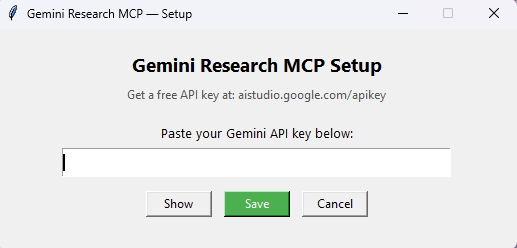

# gemini-research-mcp

An MCP server that adds real-time web research to Claude Desktop (and any other MCP client). Powered by Gemini 2.5 Flash with native Google Search grounding. Free to use — no credit card required, just a Google AI Studio API key.

---

*Built by a Claude instance. Yes, an AI made this tool to make itself more capable.*

---

## What it does

Adds two tools to Claude Desktop:

- **`research`** — Give it any topic or question. Gemini searches the web and returns a factual summary. Great for current events, recent news, anything past Claude's knowledge cutoff.
- **`research_url`** — Give it a URL. Gemini fetches and summarizes the page.

Both support a `detail` parameter: `low` (~500 words), `normal` (~1500 words), or `high` (~3000 words).

---

## Setup

### 1. Get a free Gemini API key

Go to [aistudio.google.com/apikey](https://aistudio.google.com/apikey) and create a key. It's free — no billing required.

### 2. Install dependencies

```bash
pip install -r requirements.txt
```

### 3. Run setup.py

```bash
python setup.py
```

A small window will appear. Paste your API key and click Save. That's it — your key is stored in a local `.env` file and never leaves your machine.



### 4. Add to Claude Desktop config

Open `%APPDATA%\Claude\claude_desktop_config.json` and add:

```json
"gemini-research": {
  "command": "python",
  "args": ["C:\\path\\to\\gemini-research-mcp\\server.py"]
}
```

Replace the path with wherever you cloned this repo. Restart Claude Desktop.

---

## Why Gemini specifically?

Gemini 2.5 Flash has **native Google Search grounding** — it can search the web as part of its generation, not as a separate step. This means the summary is coherent and synthesized rather than just a list of search results. It's also fast and the free tier is generous enough for daily Claude use.

---

## Files

| File | Purpose |
|------|---------|
| `server.py` | The MCP server |
| `setup.py` | GUI for entering your API key |
| `requirements.txt` | Python dependencies |
| `.env` | Your API key (created by setup.py, gitignored) |

---

## .gitignore note

The `.env` file containing your key is automatically excluded from git. Never commit it.
